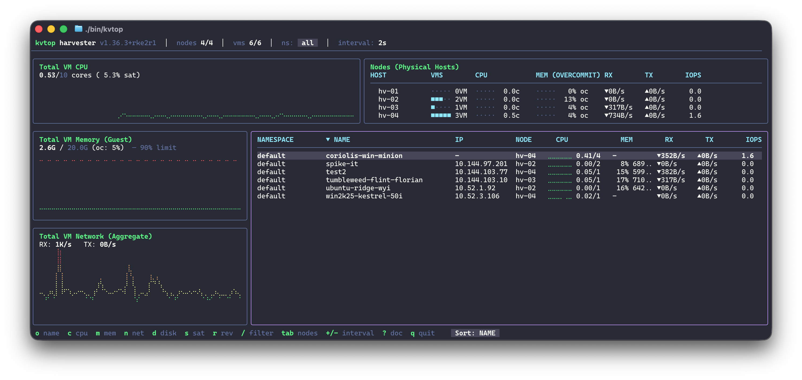
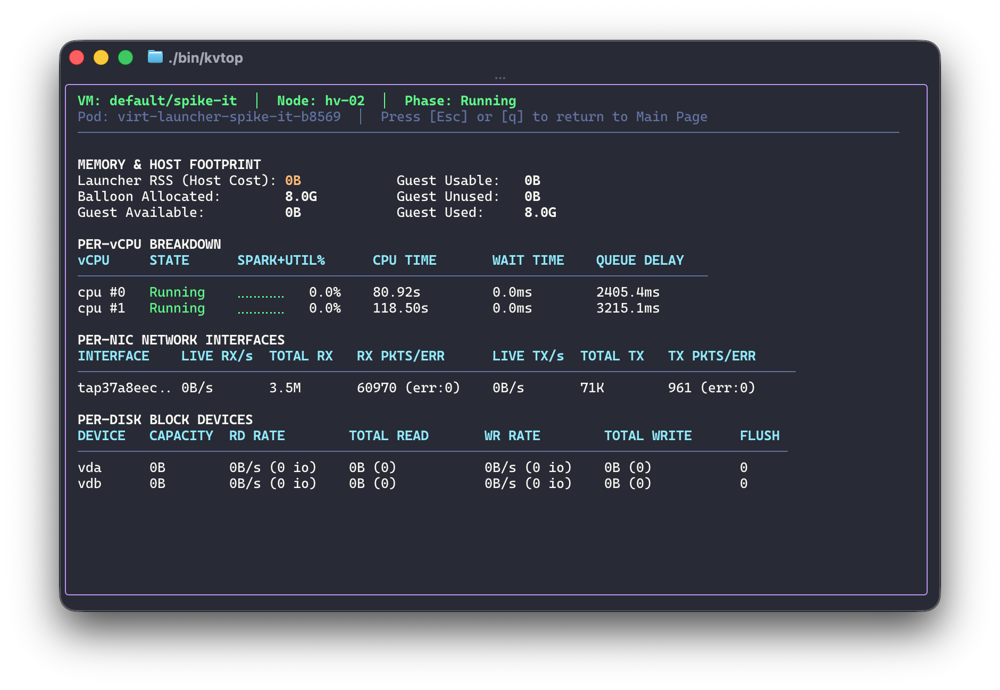

# kvtop User Manual

`kvtop` (KubeVirt top) is a terminal UI for live troubleshooting of Virtual Machines on Harvester, SUSE Virtualization, OpenShift Virtualization, and upstream KubeVirt clusters.

---

## 1. Design & Data Collection

- **Client-side only**: Single binary running locally with your `kubeconfig`. Nothing is installed on the cluster.
- **Direct virt-handler scraping**: Metrics are scraped in parallel from node `virt-handler` pods via the Kubernetes API pod proxy (`https:<pod>:8443/proxy/metrics`). One request per physical node per interval, never one per VM.
- **Informers**: Watches `VirtualMachineInstance`, `VirtualMachineInstanceMigration`, `Node`, and `Namespace` objects. State changes, node movements, and migration indicators appear immediately.
- **On-demand virsh stream**: Detailed per-vCPU and per-device metrics are streamed through `virsh domstats` in the launcher pod only while the detail view is open for a selected VM.
- **No Prometheus requirement**: Works when `rancher-monitoring` is disabled.

---

## 2. Dashboard Panels

<p align="center">
  
</p>

### Top Bar
- **Cluster & Version**: Kubernetes context name and API server version.
- **Nodes**: Ready physical hosts / total hosts.
- **VMs**: Running VMs / total VMs.
- **Migration Alert**: `⇶ N migrating` indicates active live migrations.
- **Namespace & Interval**: Active namespace filter and polling interval.

### Total VM CPU (Top-Left)
- **Scope**: Cluster-wide VM CPU sum, or scoped to the active namespace filter.
- **Metric**: Cores used over total allotted vCPUs (`coresUsed / allottedVCPUs`) with percentage saturation.
- **Graph**: 2D Unicode Braille history (300 data points).

### Nodes Panel (Top-Right)
- **Scope**: Physical hosts across the cluster (always cluster-wide).
- **Per-Host Metrics**:
  - **VM Count**: In-line horizontal density bar (`■■··· 3VM` or `■■■·· 4⇶` during migration).
  - **CPU**: Cores used and saturation bar.
  - **Memory Overcommit**: Allocated VM memory over node allocatable physical memory as a percentage and progress bar.
  - **Network**: Aggregate VM traffic passing through the host (`▼RX ▲TX`).
  - **Storage**: Aggregate VM block device IOPS.

### Total VM Memory (Guest) (Bottom-Left Top)
- **Scope**: Guest-used RAM derived from virtio balloon stats.
- **Threshold**: Guideline at 90% capacity indicates guest memory pressure.
- **Overcommit**: Ratio of total VM allocated memory over cluster allocatable memory.

### Total VM Network (Bottom-Left Bottom)
- **Scope**: Aggregate VM virtual interface traffic (`▼RX` receive / `▲TX` transmit).
- **Semantics**: Excludes host management, storage replication, and migration traffic.

### VMs Table (Bottom-Right)
- **Fluid Layout**: Dynamically expands `NAME` and `NAMESPACE` columns to available terminal width.
- **NAMESPACE**: Kubernetes namespace.
- **NAME**: VM name (`⇶` prefix indicates active live migration).
- **NODE**: Host node placement (`⇶<node>` indicates migration destination).
- **CPU (HIST+USED)**: Braille sparkline plus cores used over allotted vCPUs (e.g. `⡠⠤⠒⠒ 0.58/4`).
- **MEM GUEST%**: Guest-used memory percentage and bytes. Displays `–` if guest balloon stats are unavailable.
- **NET**: Live receive (`▼`) and transmit (`▲`) rates.
- **IOPS**: Read and write I/O operations per second.

---

## 3. VM Detail View (Drilldown)

<p align="center">
  
</p>

Press `Enter` on any VM in the table to open its detail view:

- **Host Footprint (Launcher RSS)**:
  - Separates launcher RSS (host hypervisor overhead) from guest-allocated RAM.
  - Displays balloon current, usable, available, and unused bytes.
- **Per-vCPU Breakdown**:
  - Per-core utilization percentage with live Braille sparkline.
  - Cumulative execution time, hypervisor wait time, and queue delay to detect vCPU contention.
- **Per-NIC Breakdown**:
  - Real-time throughput (`RX/s`, `TX/s`), cumulative traffic, and packet drop/error counters.
- **Per-Disk Breakdown**:
  - Real-time read/write IOPS, throughput, disk capacity, and flush counts.

---

## 4. Keybindings

| Key | Action |
|---|---|
| `Enter` | Open Detail View for selected VM (or scope node if Nodes panel is focused) |
| `Space` | Toggle host scope filter when Nodes panel is focused |
| `Esc` / `q` | Close Detail View / cancel search / clear filters |
| `Tab` | Toggle focus between VM Table and Nodes Panel |
| `o` | Sort by Namespace / VM Name (alphabetical default) |
| `c` | Sort by CPU utilization |
| `m` | Sort by Guest Memory usage |
| `n` | Sort by Network throughput |
| `d` | Sort by Disk IOPS |
| `s` | Toggle CPU sort: absolute cores (`1.80c`) vs saturation (`45%`) |
| `r` | Reverse sort order |
| `←` / `→` | Cycle sort column |
| `/` | Filter by VM name or namespace (`Enter` to apply, `Esc` to clear) |
| `+` / `-` | Increase / decrease refresh interval |
| `?` | Toggle in-app help overlay |
| `Ctrl+C` | Quit |

---

## 5. Offline Replay Mode

Run against recorded fixtures to test or demo without cluster access:

```bash
./bin/kvtop --replay testdata/
```

---

## 6. Non-Interactive CLI & Subcommands

In addition to the interactive TUI, `kvtop` runs non-interactively for shell scripts, cron jobs, and CI/CD pipelines:

```bash
# Query top VMs (supports -o json and -o table)
kvtop top --sort cpu -n 10 -o table

# Inspect a single VM with attached context
kvtop vm default/coriolis-win-minion -o json

# Inspect physical nodes and memory overcommit
kvtop nodes -o table

# Run deterministic health checks
kvtop diagnose -o table

# Suppress stderr sampling progress with -q / --quiet
kvtop top -o json -q | jq .

# Record cluster metrics to directory for offline replay
kvtop record --out ./fixtures --anonymize

# Start stdio Model Context Protocol (MCP) server
kvtop mcp

# Generate operational SKILL.md runbook for AI agents
kvtop skill --out .opencode/skills/kvtop/SKILL.md

# Generate shell autocompletion (bash, zsh, fish)
source <(kvtop completion bash)
source <(kvtop completion zsh)
kvtop completion fish | source
```

---

## 7. Related Documentation

- [Architecture & Internal Design](architecture.md): Two-frontend single-core architecture, query engine, and JSON contract.
- [MCP Prompt Guide](mcp-prompts.md): Catalog of troubleshooting questions for AI agents.
